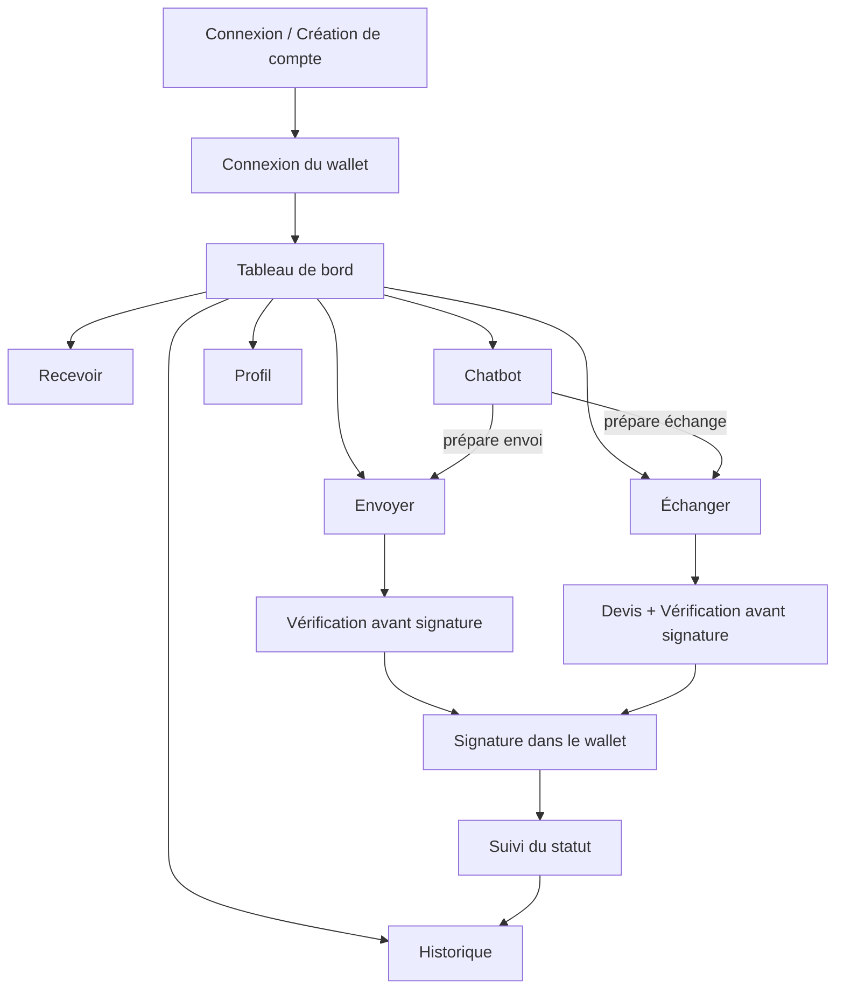

# UX et Design System — Sola

### Écrans, états, navigation et composants · MVP

**Version 1.0**

---

## 1. Objectif

Définir l'architecture des écrans, les états systématiques à prévoir, les composants réutilisables et les tokens de design de Sola, afin de garantir une interface claire, cohérente, et qui ne laisse jamais l'utilisateur signer sans avoir tout vérifié.

---

## 2. Principes de design

1. **La vérification prime sur la vitesse.** Aucun raccourci visuel ne doit permettre de sauter l'écran de récapitulatif avant signature.
2. **Rien n'est affiché sans source.** Un solde, une transaction ou une valeur toujours accompagnés d'un état de fraîcheur (à jour / en cours / erreur) — jamais une donnée silencieusement obsolète.
3. **Le chatbot et l'interface classique mènent au même endroit.** Une opération préparée par l'agent arrive sur le même écran de vérification qu'une opération préparée manuellement.
4. **Mobile-first, sans exception.** Chaque écran est conçu d'abord pour un écran étroit, en prévision du rendu dans le conteneur Telegram.
5. **Les erreurs sont explicites, jamais silencieuses.** Un échec de synchronisation, une adresse invalide ou un devis expiré sont toujours visibles et expliqués, jamais masqués par un état par défaut rassurant.

---

## 3. Identité visuelle retenue

Direction choisie après exploration : l'esthétique « terminal DeFi » (inspirée de Sandclock — canvas quasi-neutre, bordures hairline, un seul accent chromatique utilisé comme signal fonctionnel plutôt que décoratif), **déclinée en version claire** plutôt que sombre. Le principe reste identique : la confiance se communique par la retenue, pas par la décoration.

### 3.1 Couleurs

| Nom | Valeur | Rôle |
| --- | --- | --- |
| Canvas | `#FFFFFF` | Fond principal des écrans |
| Carte | `#F6F6F4` | Cartes (solde, transaction, devis, brouillon d'opération) |
| Bordure | `#E4E4E1` | Bordures hairline, séparateurs — la structure de chaque conteneur |
| Texte primaire | `#0A0A0A` | Texte principal, montants, labels importants |
| Texte secondaire (muted) | `#6E6E6E` | Texte de support, légendes, horodatages |
| Accent signal | `#3FE280` | **Seul accent chromatique** : CTA principal (Envoyer, Échanger, Signer), indicateur de synchronisation, bordure de la carte solde |
| Accent signal (texte) | `#1B8F52` | Variante plus foncée de l'accent, utilisée uniquement quand le vert doit porter du texte sur fond blanc (contraste AA) |
| Erreur | `#D64545` | Solde insuffisant, adresse invalide, échec réseau — seule autre couleur chromatique tolérée, réservée aux états bloquants |
| Attention | `#C98A1F` | Devis proche de l'expiration, synchronisation en cours |

**Règle non négociable héritée de Sandclock** : le vert signal n'apparaît jamais comme couleur de fond décorative ni sur du texte courant — seulement sur les actions principales, les bordures de cartes à données vivantes (solde), et les indicateurs d'état. Si une nouvelle couleur semble nécessaire ailleurs, c'est un signal qu'on en a trop mis.

### 3.2 Typographie

- **Inter** pour tout le texte d'interface (corps, boutons, nav, cartes), avec un tracking positif léger (`0.02–0.05em`) qui donne un ton légèrement technique, cohérent avec un produit financier.
- Une police display (type Aeonik, ou substitut gratuit comme Satoshi / General Sans) réservée à un unique moment d'accroche (ex. écran d'accueil avant connexion) — jamais utilisée pour les écrans fonctionnels du produit.
- Échelle réduite et lisible sur petit écran : titre d'écran, titre de section, corps, légende/horodatage.
- Les montants (soldes, montants d'opération) utilisent un poids plus marqué (500) que le texte courant (400) — **deux graisses seulement**, jamais plus, pour rester cohérent avec la sobriété de l'ensemble.

### 3.3 Formes et espacement

- Rayon de coin : **12px pour les cartes**, **16px pour les boutons** — ce couple 12/16 est la signature géométrique du produit, à ne pas mélanger avec d'autres valeurs.
- Grille d'espacement cohérente (base 8px), avec des sections respirées (pas de densité excessive) même si les écrans restent compacts sur mobile.
- Zones tactiles d'au moins 44px de hauteur pour tout élément interactif.
- **Aucune ombre portée, aucun dégradé.** La profondeur se communique par le contraste canvas/carte/bordure, jamais par l'élévation visuelle — cohérent avec le principe « la confiance se dit par la retenue ».

### 3.4 Application au thème sombre (phase 2 / Telegram)

Les mêmes rôles (Canvas, Carte, Bordure, Texte primaire/secondaire, Accent signal) sont redéfinis en version sombre au moment de l'intégration Telegram, en gardant la même logique : l'accent signal reste la seule touche chromatique, quel que soit le thème.

---

## 4. Architecture de navigation

**Navigation principale (mobile)** : barre basse à 4 à 5 entrées — Tableau de bord, Historique, Chatbot, Profil (+ Admin si le compte est administrateur). Les écrans Recevoir, Envoyer, Échanger sont atteints depuis le tableau de bord, jamais depuis la barre principale, pour ne pas banaliser des actions sensibles.

---

## 5. Inventaire des écrans

### 5.1 Connexion / Création de compte

- Champs minimaux, option future « connexion via Telegram » déjà prévue dans la maquette (désactivée au MVP web).
- Aucun champ ne doit jamais ressembler, même visuellement, à un champ de saisie de clé privée.

### 5.2 Connexion du wallet

- Liste des wallets compatibles (adaptateur standard).
- Affichage immédiat, après connexion, de l'adresse (tronquée avec option copier) et du réseau détecté.

### 5.3 Tableau de bord

- Carte solde SOL, carte solde USDT, valeur indicative globale.
- Bouton « masquer les soldes » toujours visible, en haut de l'écran.
- État de synchronisation (à jour / en cours / erreur) affiché en permanence, jamais seulement au chargement initial.
- Accès direct aux actions : Recevoir, Envoyer, Échanger.

### 5.4 Historique

- Liste chronologique : reçu / envoyé / swap, avec montant, date, frais, statut, lien explorateur.
- États : liste normale, liste vide (« aucune transaction pour l'instant »), erreur de chargement.

### 5.5 Chatbot

- Zone de conversation classique, avec les réponses de l'agent toujours accompagnées de la donnée réelle affichée (ex. un chiffre de solde répété dans le texte doit correspondre exactement à celui du tableau de bord).
- Lorsqu'une opération est préparée, une carte distincte (pas juste du texte) résume le brouillon et propose un bouton « Vérifier et continuer » qui mène à l'écran de vérification standard.

### 5.6 Recevoir

- Sélecteur SOL / USDT.
- Adresse complète, bouton copier avec confirmation visuelle, QR code.
- Bandeau permanent : rappel du réseau Solana et avertissement contre l'envoi depuis un mauvais réseau.

### 5.7 Envoyer

- Formulaire : destinataire, token, montant.
- Dès que les champs sont valides, affichage automatique des frais réseau et du solde après opération, avant même d'arriver à l'écran de vérification.
- Blocage explicite si solde insuffisant ou adresse invalide, avec message clair à l'endroit du champ concerné.

### 5.8 Échanger

- Sélection token vendu / token reçu, montant.
- Demande de devis explicite (action de l'utilisateur, pas automatique en continu).
- Carte devis : taux, montant estimé, frais réseau, frais Sola (deux lignes séparées), compte à rebours d'expiration visible.

### 5.9 Écran de vérification avant signature (commun Envoi / Échange)

- Écran non contournable : seul chemin vers la signature.
- Résumé complet : destinataire ou devis, montant, frais réseau, frais Sola, solde après opération.
- Bouton d'action clairement distinct (« Signer dans mon wallet ») — jamais libellé de façon à suggérer que Sola signe à la place de l'utilisateur.

### 5.10 Suivi du statut

- États explicites : en attente de signature, diffusée, confirmée, échouée.
- Lien direct vers l'explorateur Solana dès que la signature est disponible.

### 5.11 Profil

- Informations de compte, wallets liés, préférence masquer les soldes par défaut, (futur) connexion Telegram.

### 5.12 Administration (minimal, P0 réduit)

- Configuration des règles de frais (`config_frais`), historique des revenus agrégés, accès aux journaux de sécurité.

---

## 6. États systématiques à prévoir sur chaque écran de données

| État | Traitement visuel attendu |
| --- | --- |
| Chargement initial | squelette de contenu (skeleton), jamais un écran vide sans indication |
| Synchronisation en arrière-plan | indicateur discret, sans bloquer la lecture des données déjà affichées |
| Erreur réseau / RPC indisponible | message explicite + action « réessayer », aucune donnée présentée comme à jour |
| Donnée vide (pas de transaction, pas de wallet lié) | message contextuel, jamais un écran blanc |
| Succès / confirmation | retour visuel net (ex. statut « confirmé » en couleur succès) |
| Expiration (devis) | bascule automatique de l'état visuel + blocage de l'action de signature |

---

## 7. Composants clés

- **Carte solde** : montant, token, état masqué/visible, lien vers l'historique filtré.
- **Ligne de transaction** : icône de type (reçu/envoyé/swap), montant, date, statut, lien explorateur.
- **Carte devis** : taux, montant estimé, deux lignes de frais, compte à rebours d'expiration.
- **Bandeau réseau** : rappel permanent du réseau Solana sur les écrans Recevoir/Envoyer.
- **Carte de brouillon d'opération (agent)** : résumé structuré d'une préparation du chatbot, jamais un simple paragraphe de texte.
- **Écran de vérification** : composant unique réutilisé pour Envoi et Échange, pour garantir que la même rigueur s'applique partout.
- **Indicateur de synchronisation** : pastille ou icône cohérente sur tous les écrans affichant des données on-chain.

---

## 8. Accessibilité et contraintes mobiles

- Zones sûres respectées en haut et en bas d'écran (préparation au rendu dans le conteneur Telegram).
- Contraste suffisant entre texte et fond, y compris en thème sombre.
- Taille de police et zones tactiles pensées pour un usage à une main.
- Aucune action sensible (signer, envoyer) déclenchable par un geste accidentel (pas de swipe-to-confirm sur une action irréversible).

---

## 9. Thème clair / sombre

- Les deux thèmes sont construits dès le MVP web, avec les mêmes tokens fonctionnels (section 3.1).
- En phase 2, le thème sera synchronisé automatiquement avec les variables transmises par le SDK Telegram Web Apps, sans logique supplémentaire si les tokens sont bien structurés dès maintenant.

---

## 10. Prochaines étapes

- Déclinaison de ces écrans en maquettes haute-fidélité.
- Au moment de l'implémentation du frontend TanStack Start, application des skills Claude Code (Taste Skill pour la direction visuelle, Impeccable pour la cohérence et le contrôle qualité) afin de garantir un rendu professionnel et cohérent sur la durée du projet.