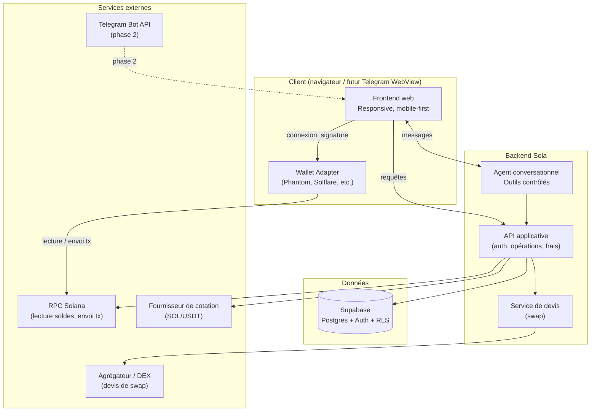

# Architecture technique — Sola

### Document d'architecture · MVP

**Version 1.0**

---

## 1. Principes directeurs

1. **Non-custodial** : Sola ne détient, ne stocke, ni ne transmet jamais de clé privée ou de phrase secrète. Toute signature se fait dans le wallet de l'utilisateur.
2. **Agent sans autorité d'exécution** : l'agent conversationnel peut *lire* des données et *préparer* des opérations via des outils strictement définis, mais ne peut jamais signer ni confirmer une transaction.
3. **Séparation utilisateur / canal** : l'authentification et les données utilisateur sont indépendantes du canal d'accès (web aujourd'hui, Telegram demain), pour permettre l'intégration Telegram sans réécriture.
4. **Vérité on-chain** : toute donnée financière affichée (solde, historique, statut) provient d'une lecture blockchain ou d'une source de cotation datée — jamais d'une valeur mise en cache sans horodatage visible.
5. **Mobile-first** dès le MVP web, pour anticiper le rendu dans le conteneur Telegram.

**Stack retenue** : [TanStack Start](https://tanstack.com/start) (framework full-stack React, basé sur TanStack Router) pour le frontend et les fonctions serveur, [Supabase](https://supabase.com) (Postgres + Auth + Row Level Security) pour la base de données, hébergement sur Vercel. TanStack Start est actuellement en Release Candidate (ligne 1.168.x) — bien adapté à une application authentifiée comme Sola (pas de besoin SEO fort), mais sans garantie de stabilité API totale avant sa version stable.

---

## 2. Vue d'ensemble

**Lecture du schéma** : le frontend ne parle jamais directement à la blockchain pour signer — il délègue la signature au wallet de l'utilisateur. Le backend sert de couche de vérité (données, règles de frais, préparation d'opérations) mais ne détient aucune clé.

---

## 3. Frontend — TanStack Start

**Rôle** : interface responsive, mobile-first, affichage des données réelles, préparation des opérations, interface de signature déléguée au wallet.

**Pourquoi TanStack Start** : framework full-stack React bâti sur TanStack Router, avec routage type-safe et fonctions serveur (`createServerFn`) colocalisées avec les routes. Pertinent ici car Sola est avant tout une application authentifiée (tableau de bord, opérations) sans enjeu SEO fort — le cas d'usage pour lequel Router/Start est recommandé plutôt qu'un framework orienté rendu public.

**Responsabilités clés**

- Connexion/déconnexion du wallet via un adaptateur standard Solana (ex. Wallet Adapter).
- Affichage des soldes, de l'historique et des devis — toujours avec un état de synchronisation visible (à jour / en cours / erreur).
- Construction des écrans de vérification avant signature (récapitulatif complet obligatoire).
- Interface du chatbot, affichant les réponses de l'agent et les brouillons d'opération proposés.
- Aucune logique de calcul de frais définitive côté client : le frontend affiche ce que le backend calcule, il ne le recalcule pas lui-même pour la confirmation finale.

**Contrainte de conception**

- Composants et navigation pensés pour un écran mobile étroit dès le départ (zones sûres, thème clair/sombre), afin que l'intégration Telegram (phase 2) ne nécessite pas de refonte.

---

## 4. Backend applicatif — fonctions serveur TanStack Start

**Rôle** : point de vérité unique entre le frontend, la base de données, la blockchain et les services externes.

**Implémentation** : les fonctions serveur de TanStack Start (`createServerFn`) exposent les opérations sensibles (lecture soldes, calcul de frais, préparation de transaction, devis) sans passer par une API séparée à maintenir. Elles s'exécutent uniquement côté serveur et communiquent avec Supabase via le client serveur (clé service), jamais exposée au client.

**Responsabilités clés**

- Authentification et gestion de session (indépendante du canal).
- Lecture des soldes et de l'historique via RPC Solana, avec mise en forme et mise en cache courte (toujours horodatée).
- Calcul des frais (réseau + Sola) **avant** toute confirmation, selon les règles de commission configurées.
- Génération et gestion du cycle de vie des devis d'échange (taux, expiration).
- Construction des transactions non signées (unsigned transactions) à faire signer par le wallet — le backend ne signe jamais.
- Suivi du statut on-chain après diffusion d'une transaction signée.
- Exposition d'un ensemble d'**outils contrôlés** pour l'agent conversationnel (voir section 5).
- Écriture systématique dans les journaux de sécurité pour toute action sensible.

**Principe de sécurité central** Le backend prépare des transactions *non signées*. La signature a lieu exclusivement côté client, dans le wallet. Le backend ne reçoit jamais de clé privée et ne peut, par construction, pas signer à la place de l'utilisateur.

---

## 5. Agent conversationnel (chatbot)

**Rôle** : interface en langage naturel vers les mêmes données et actions que l'interface classique — rien de plus, rien de moins.

**Architecture en outils contrôlés (tool-calling)** L'agent ne reçoit jamais un accès libre aux données ou à la blockchain. Il dispose d'un ensemble fermé d'outils, chacun avec un contrat strict :

| Outil | Entrée | Sortie | Contrainte |
| --- | --- | --- | --- |
| `get_balance` | wallet_id | soldes SOL/USDT + horodatage | lecture seule |
| `get_transactions` | wallet_id, filtre | liste de transactions réelles | lecture seule |
| `get_portfolio_value` | wallet_id | valeur indicative + source cotation | lecture seule |
| `prepare_send` | token, montant, destinataire | brouillon d'opération (non signé) | ne signe jamais, ne diffuse jamais |
| `prepare_swap` | token vendu, token reçu, montant | devis (taux, frais, expiration) | ne signe jamais |

**Règles non négociables**

- Si une donnée n'est pas disponible via un outil, l'agent doit le dire explicitement — interdiction absolue de compléter par une valeur plausible.
- Toute préparation d'opération (`prepare_send`, `prepare_swap`) redirige systématiquement vers l'écran de vérification standard. L'agent ne peut pas conclure une opération dans la conversation elle-même.
- Chaque échange avec l'agent est journalisé (table `messages_agent`) pour audit.

---

## 6. Intégration wallet Solana

**Flux de connexion**

1. L'utilisateur choisit son wallet (Phantom, Solflare, etc.) via l'adaptateur standard.
2. Le frontend récupère l'adresse publique et le réseau courant — jamais de clé privée.
3. Le backend associe l'adresse publique au profil utilisateur (table `wallets_lies`).

**Flux de signature (envoi ou swap)**

1. Le backend construit une transaction non signée à partir des paramètres vérifiés (montant, destinataire ou devis).
2. Le frontend affiche le récapitulatif complet (étape de vérification obligatoire).
3. La transaction est transmise au wallet de l'utilisateur pour signature.
4. Le wallet retourne la transaction signée au frontend, qui la transmet au backend pour diffusion sur le réseau (ou la diffuse lui-même selon l'implémentation du wallet).
5. Le backend suit le statut via RPC jusqu'à confirmation ou échec, et met à jour l'historique.

**Détection réseau** Le réseau annoncé par le wallet est vérifié à chaque action sensible. Toute incohérence (ex. devnet au lieu de mainnet) bloque l'opération avec un message explicite, avant même la construction de la transaction.

---

## 7. Base de données (Supabase)

**Choix** : Postgres via Supabase, avec authentification intégrée et Row Level Security (RLS) pour l'isolation stricte entre utilisateurs.

**Tables principales** (reprises du PRD, précisées ici)

| Table | Contenu | Note sécurité |
| --- | --- | --- |
| `profils` | identité utilisateur, préférences | RLS : accès au profil propre uniquement |
| `wallets_lies` | adresse publique, réseau, utilisateur propriétaire | jamais de clé privée |
| `operations` | brouillons préparés (envoi/swap), statut (brouillon, vérifié, signé, annulé) | créées par utilisateur ou agent, jamais auto-exécutées |
| `transactions` | résultats confirmés on-chain, signature, statut, frais | source de vérité pour l'historique affiché |
| `devis` | taux, montants, expiration, opération liée | expiration stricte, contrôlée côté backend |
| `frais` | frais réseau et frais Sola, séparés, liés à une transaction | base du calcul des revenus |
| `messages_agent` | historique des échanges chatbot, outils appelés | utilisé pour audit et amélioration |
| `journaux_securite` | connexions, actions sensibles, erreurs, changements de réseau | lecture admin uniquement |

**Permissions**

- RLS activé sur toutes les tables contenant des données utilisateur.
- Chaque politique RLS filtre strictement par `user_id` correspondant à la session authentifiée.
- Les tables de configuration (règles de frais) sont en lecture pour les utilisateurs, en écriture pour les administrateurs uniquement.

---

## 8. Système de frais — implémentation

- Les règles de commission sont stockées en base (table de configuration), modifiables par un administrateur sans déploiement.
- Le calcul s'effectue côté backend, au moment de la préparation de l'opération (`prepare_send`, `prepare_swap`), et est affiché avant toute signature.
- Les frais réseau (Solana) et les frais Sola sont calculés et enregistrés comme deux lignes distinctes, jamais fusionnées.
- Chaque transaction confirmée génère une entrée dans `frais`, utilisée pour l'historique des revenus et le tableau de bord admin.

---

## 9. Préparation à l'intégration Telegram (phase 2)

Dès le MVP, l'architecture respecte ces contraintes pour permettre l'ajout de Telegram sans réécriture :

- **Authentification découplée** : le système d'identité ne dépend pas de Telegram ; une couche `TelegramAdapter` optionnelle viendra mapper une identité Telegram validée à un profil existant.
- **Validation serveur des données Telegram** : toute donnée reçue depuis le client Telegram (`initData`) sera vérifiée côté backend (signature HMAC) avant d'être approuvée — jamais de confiance aveugle au client.
- **Thème et zones sûres** : le frontend gère déjà les thèmes clair/sombre et les zones sûres d'écran mobile, ce que Telegram exploitera directement via les variables transmises par son SDK.
- **Navigation adaptable** : la structure de navigation reste compatible avec un rendu en conteneur (sans dépendre de comportements propres au navigateur, ex. barre d'adresse).

---

## 10. Déploiement et environnements

- **Hébergement frontend/backend** : Vercel, application TanStack Start (ex. `sola.vercel.app` en phase de développement, domaine définitif ensuite).
- **Base de données** : Supabase (environnement géré, RLS activé dès le premier déploiement, client service réservé aux fonctions serveur TanStack Start).
- **Environnements distincts** : développement / préproduction / production, avec configuration réseau Solana (devnet en dev, mainnet en production) clairement séparée pour éviter toute confusion de réseau.
- **Secrets** : clés d'API (RPC, cotation, agent conversationnel) gérées via variables d'environnement côté backend uniquement — jamais exposées côté client.

---

## 11. Observabilité et journaux

- **Journaux de sécurité** : connexions, changements de réseau détectés, tentatives d'opération, échecs de signature.
- **Journaux d'agent** : chaque appel d'outil par l'agent est tracé (nom de l'outil, paramètres, résultat résumé) pour permettre un audit en cas de doute sur une réponse du chatbot.
- **Suivi des transactions** : statut on-chain interrogé jusqu'à confirmation finale ou échec, avec horodatage de chaque changement d'état.

---

## 12. Ce que cette architecture garantit

- Aucune clé privée ni phrase secrète ne transite ou n'est stockée côté Sola, à aucune étape.
- Aucune opération financière n'est exécutée sans passage explicite par l'écran de vérification et par la signature dans le wallet.
- Aucune réponse du chatbot ne peut provenir d'une source autre que les outils contrôlés — pas de génération libre de chiffres.
- L'isolation des données entre utilisateurs est garantie au niveau base de données (RLS), pas seulement au niveau applicatif.
- L'ajout de Telegram en phase 2 ne nécessite ni réécriture de l'authentification, ni refonte de l'interface.