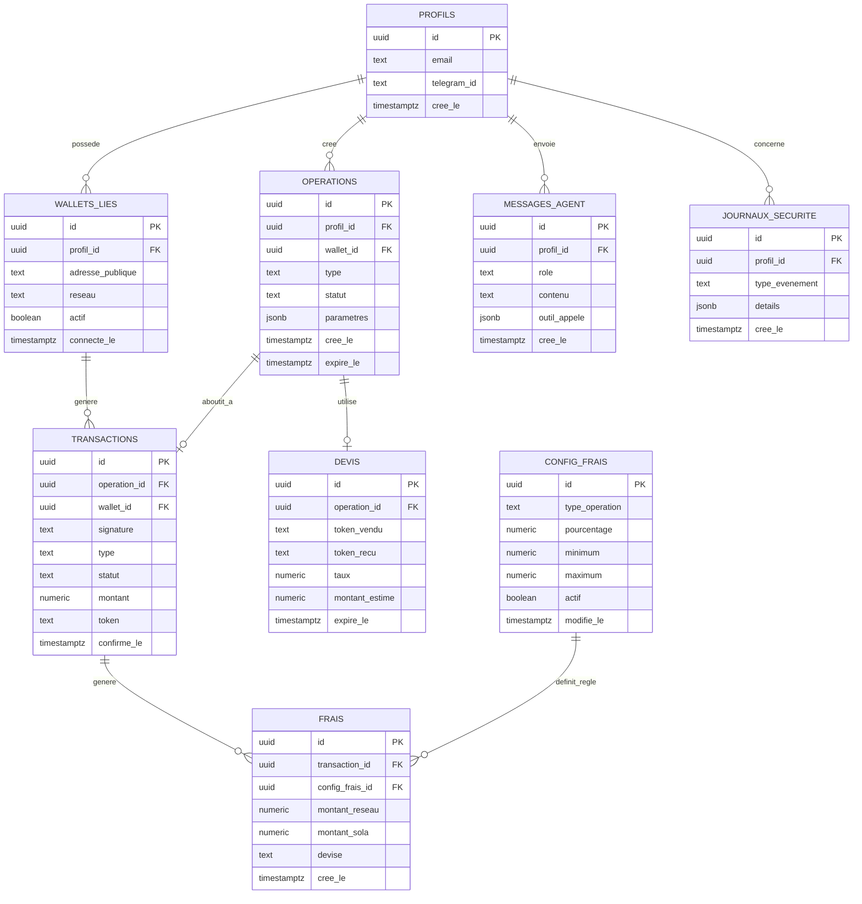

# Données et API — Sola

### Schéma de base de données et contrats d'interface · MVP

**Version 1.0**

---

## 1. Objectif

Spécifier le schéma complet des tables Supabase, les politiques de sécurité (RLS), et les contrats des fonctions serveur TanStack Start et des outils de l'agent conversationnel, afin de servir de référence directe pour le développement.

---

## 2. Schéma relationnel — vue d'ensemble

---

## 3. Détail des tables

### 3.1 `profils`

| Colonne | Type | Contrainte |
| --- | --- | --- |
| `id` | uuid | PK, lié à `auth.users.id` (Supabase Auth) |
| `email` | text | unique, nullable si connexion future par Telegram uniquement |
| `telegram_id` | text | unique, nullable (phase 2) |
| `cree_le` | timestamptz | défaut `now()` |

**RLS** : un utilisateur ne peut lire/modifier que la ligne où `id = auth.uid()`.

### 3.2 `wallets_lies`

| Colonne | Type | Contrainte |
| --- | --- | --- |
| `id` | uuid | PK |
| `profil_id` | uuid | FK → `profils.id`, non nul |
| `adresse_publique` | text | non nul, pas de clé privée associée nulle part |
| `reseau` | text | `mainnet` / `devnet`, non nul |
| `actif` | boolean | défaut `true` |
| `connecte_le` | timestamptz | défaut `now()` |

**RLS** : lecture/écriture limitées aux lignes où `profil_id = auth.uid()`.

### 3.3 `operations`

Brouillons préparés (envoi ou swap), avant signature.

| Colonne | Type | Contrainte |
| --- | --- | --- |
| `id` | uuid | PK |
| `profil_id` | uuid | FK → `profils.id` |
| `wallet_id` | uuid | FK → `wallets_lies.id` |
| `type` | text | `envoi` / `swap` |
| `statut` | text | `brouillon` / `verifie` / `signe` / `expire` / `annule` |
| `parametres` | jsonb | destinataire, montant, token, ou référence au devis |
| `cree_le` | timestamptz | défaut `now()` |
| `expire_le` | timestamptz | nul pour un envoi simple, requis pour un swap (lié au devis) |

**RLS** : lecture/écriture limitées à `profil_id = auth.uid()`.

### 3.4 `transactions`

Résultat confirmé on-chain d'une opération signée.

| Colonne | Type | Contrainte |
| --- | --- | --- |
| `id` | uuid | PK |
| `operation_id` | uuid | FK → `operations.id`, nullable si transaction détectée hors flux Sola (ex. réception) |
| `wallet_id` | uuid | FK → `wallets_lies.id` |
| `signature` | text | signature on-chain, unique |
| `type` | text | `recu` / `envoye` / `swap` |
| `statut` | text | `en_attente` / `confirme` / `echoue` |
| `montant` | numeric |  |
| `token` | text | `SOL` / `USDT` |
| `confirme_le` | timestamptz | nul tant que non confirmé |

**RLS** : lecture limitée aux transactions dont le `wallet_id` appartient à `auth.uid()`.

### 3.5 `devis`

| Colonne | Type | Contrainte |
| --- | --- | --- |
| `id` | uuid | PK |
| `operation_id` | uuid | FK → `operations.id` |
| `token_vendu` | text |  |
| `token_recu` | text |  |
| `taux` | numeric |  |
| `montant_estime` | numeric |  |
| `expire_le` | timestamptz | requis, vérifié côté serveur avant signature |

**RLS** : lecture limitée via jointure sur `operations.profil_id = auth.uid()`.

### 3.6 `frais`

| Colonne | Type | Contrainte |
| --- | --- | --- |
| `id` | uuid | PK |
| `transaction_id` | uuid | FK → `transactions.id` |
| `config_frais_id` | uuid | FK → `config_frais.id` |
| `montant_reseau` | numeric | frais Solana, séparé |
| `montant_sola` | numeric | commission Sola, séparée |
| `devise` | text |  |
| `cree_le` | timestamptz | défaut `now()` |

**RLS** : lecture utilisateur limitée à ses propres transactions ; lecture globale réservée au rôle admin (vue agrégée pour le tableau de bord des revenus).

### 3.7 `config_frais`

| Colonne | Type | Contrainte |
| --- | --- | --- |
| `id` | uuid | PK |
| `type_operation` | text | `envoi` / `swap` |
| `pourcentage` | numeric |  |
| `minimum` | numeric | nullable |
| `maximum` | numeric | nullable |
| `actif` | boolean | défaut `true` |
| `modifie_le` | timestamptz | mis à jour à chaque changement |

**RLS** : lecture pour tout utilisateur authentifié (transparence), écriture réservée au rôle admin.

### 3.8 `messages_agent`

| Colonne | Type | Contrainte |
| --- | --- | --- |
| `id` | uuid | PK |
| `profil_id` | uuid | FK → `profils.id` |
| `role` | text | `utilisateur` / `agent` |
| `contenu` | text |  |
| `outil_appele` | jsonb | nom de l'outil + paramètres + résumé du résultat, nullable |
| `cree_le` | timestamptz | défaut `now()` |

**RLS** : lecture/écriture limitées à `profil_id = auth.uid()`.

### 3.9 `journaux_securite`

| Colonne | Type | Contrainte |
| --- | --- | --- |
| `id` | uuid | PK |
| `profil_id` | uuid | FK → `profils.id`, nullable (événement système) |
| `type_evenement` | text | ex. `connexion`, `changement_reseau`, `echec_signature` |
| `details` | jsonb |  |
| `cree_le` | timestamptz | défaut `now()` |

**RLS** : aucune lecture utilisateur standard ; réservé au rôle admin.

---

## 4. Contrats des fonctions serveur (TanStack Start `createServerFn`)

| Fonction | Entrée | Sortie | Erreurs possibles |
| --- | --- | --- | --- |
| `getWalletBalance` | `walletId` | `{ sol, usdt, valeurIndicative, synchroniseLe }` | `RPC_INDISPONIBLE`, `WALLET_INTROUVABLE` |
| `getTransactionHistory` | `walletId, filtre?` | liste de `transactions` | `RPC_INDISPONIBLE` |
| `prepareSend` | `walletId, destinataire, token, montant` | `operation` (brouillon) avec frais calculés | `SOLDE_INSUFFISANT`, `ADRESSE_INVALIDE`, `RESEAU_INCOHERENT` |
| `prepareSwap` | `walletId, tokenVendu, tokenRecu, montant` | `devis` lié à une `operation` | `LIQUIDITE_INSUFFISANTE`, `COTATION_INDISPONIBLE` |
| `buildUnsignedTransaction` | `operationId` | transaction non signée (format wallet adapter) | `OPERATION_EXPIREE`, `OPERATION_DEJA_TRAITEE` |
| `submitSignedTransaction` | `operationId, transactionSignee` | `transaction` avec statut `en_attente` | `SIGNATURE_INVALIDE`, `DIFFUSION_ECHOUEE` |
| `getTransactionStatus` | `signature` | statut actualisé | `RPC_INDISPONIBLE` |
| `getFeeConfig` | *(aucune)* | règles de frais actives | — |
| `updateFeeConfig` *(admin)* | `typeOperation, pourcentage, minimum?, maximum?` | configuration mise à jour | `NON_AUTORISE` |

**Règle commune** : chaque fonction vérifie la session active (`auth.uid()`) et ne retourne/modifie que des ressources appartenant à l'utilisateur authentifié, sauf fonctions explicitement marquées *(admin)*.

---

## 5. Contrats des outils de l'agent conversationnel

Repris et détaillés depuis le document d'architecture :

| Outil | Entrée | Sortie | Garde-fou |
| --- | --- | --- | --- |
| `get_balance` | `walletId` | soldes réels + horodatage | lecture seule, aucune valeur par défaut si indisponible |
| `get_transactions` | `walletId, filtre?` | liste réelle, identique à l'écran Historique | lecture seule |
| `get_portfolio_value` | `walletId` | valeur + source de cotation datée | lecture seule, signale l'indisponibilité explicitement |
| `prepare_send` | `token, montant, destinataire` | `operation` brouillon (non signée) | redirige systématiquement vers l'écran de vérification |
| `prepare_swap` | `tokenVendu, tokenRecu, montant` | `devis` lié à une `operation` | redirige systématiquement vers l'écran de vérification |

Chaque appel est journalisé dans `messages_agent.outil_appele`.

---

## 6. Conventions

- **Nommage** : tables et colonnes en français, snake_case, cohérent avec le reste de la documentation produit.
- **Migrations** : toute modification de schéma passe par une migration versionnée Supabase, jamais par une modification manuelle en production.
- **Horodatage** : toutes les tables exposant une donnée affichée à l'utilisateur incluent un champ temporel explicite (`cree_le`, `confirme_le`, `expire_le`, `synchroniseLe`), conformément à l'exigence de traçabilité du PRD.